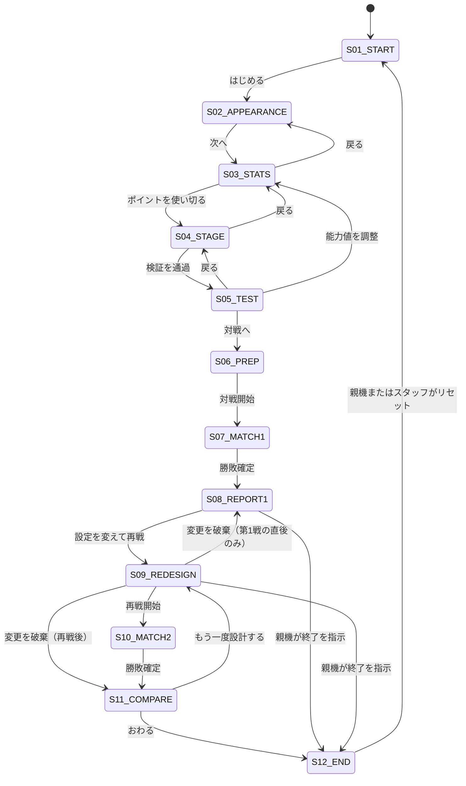

# 体験フロー仕様（user-flow.md）

- 文書ID: EXP-FLOW
- バージョン: 0.1
- 状態: 草案
- 上位文書: [system-overview.md](../00-overview/system-overview.md)（§3、§7）
- 関連: [glossary.md](../00-overview/glossary.md)、[scope.md](../00-overview/scope.md)

## 1. 概要

参加者が「ファイター作成 → ステージ → テスト → 第1戦 → Battle Report → 再設計 → 第2戦 → 結果比較」を迷わず通すための、画面一覧・状態遷移・各ステップの目安時間・例外時の扱いを定義する。

## 2. 目的

- 学習サイクル（設定 → 対戦 → 評価 → 変更 → 再戦）を、画面の流れとして固定する。
- 各画面が受け取る・渡すデータを明確にし、実装（#35）と各仕様書の境界にする。
- 戻る・やり直し・途中離脱で、体験が止まらないようにする（NFR-01）。

## 3. Requirements

| ID | 要求 | 本書での具体化 |
|---|---|---|
| REQ-EXP-01 | 能力値を設定し、画面で確認できる | S03（§5.3） |
| REQ-EXP-02 | 設定が挙動に反映される | S05 テスト（§5.5） |
| REQ-EXP-03 | 1対1の対戦と、勝敗・結果の確認 | S07、S08 |
| REQ-EXP-04 | 第1戦後に設定を変更して再戦 | S09、S10（§5.9） |
| REQ-EXP-05 | 第1戦と第2戦の設定・結果の比較 | S11 |
| REQ-RPT-02 | 各戦の CharacterConfig を保存する | §6.2 |
| REQ-OPS-01 | 短時間で説明・操作でき、当日安定して運用できる | §7、§8 |
| REQ-NET-01 | PCで対戦ルームを作り、QRでスマートフォン参加（目標） | S06（§5.6） |
| REQ-SHR-01 | 持ち帰り用QRで設定を復元（目標） | S12（§5.12） |
| NFR-02 | 中学生が短い説明で使える | 1画面1目的（§4） |
| （候補）REQ-OPS-02 | 進行を管理する親機から、再戦の回数や終了を管理できる | §5.12、§8、§9（system-overview.md への追加は未実施） |

## 4. 基本方針

- **1画面1目的。** 1つの画面で決めることを1つに絞り、次に何をするかが画面から分かるようにする（設計原則 6）。
- **MVP は PC 1台のローカル対戦。** ネットワーク対戦（S06 の QR 参加）は目標機能で、ローカル対戦と切り分けて実装する（[scope.md](../00-overview/scope.md)）。
- **失敗や中断のたびに待たせない。** 検証エラーや操作ミスでは、理由と次の操作を示し、やり直せるようにする。
- **再戦は何度でもできる。** ただし体験は1ターン約20分に収める必要があるため、進行を管理する親機から、進行を自由に管理できるようにする（§5.12）。
- **答えを押しつけない。** Report と比較は結果と判断材料を示し、改善方法を一つに決めつけない（設計原則 3）。

## 5. 画面一覧と各ステップ

### 5.1 全体の流れ

```text
S01 スタート
  ↓
S02 見た目を選ぶ ──→ S03 能力値を決める
  ↓
S04 ステージを決める
  ↓
S05 試しに動かす（操作確認・テスト）
  ↓
S06 対戦の準備（ローカル / ルーム作成・QR表示[目標]）
  ↓
S07 第1戦 ──→ S08 Battle Report
                  ↓
              S09 設定を変えて作り直す
                  ↓
              S10 再戦 ──→ S11 結果の比較 ──→ （もう一度）S09 へ戻る
                                ↓
                            S12 おわり（持ち帰り[目標]）
```

### 5.2 画面一覧

| ID | 画面 | 目的 | 区分 | 次へ進む条件 |
|---|---|---|---|---|
| S01 | スタート | 体験の概要を知り、始める | MVP | 「はじめる」を押す |
| S02 | 見た目を選ぶ | Body / Face / Color / Accessory / 名前を選ぶ | MVP | 選択済み（名前は未入力ならデフォルト名） |
| S03 | 能力値を決める | 4つの能力値にポイントを配分する | MVP | 合計ポイントを使い切る |
| S04 | ステージを決める | プリセットを選ぶ、またはエディタで作る | MVP | 検証を通過したステージがある |
| S05 | 試しに動かす | 自分のファイターとステージで操作を確認する | MVP | 「対戦へ」を押す（試さなくても進める） |
| S06 | 対戦の準備 | 対戦相手（標準設定で開始）と操作方法を確認する。相手の能力値は変更できる。目標機能ではルーム作成とQR表示 | MVP（QR は目標） | 「対戦開始」を押す |
| S07 | 第1戦 | 1対1で対戦する | MVP | 勝敗が確定する |
| S08 | Battle Report | 勝敗と指標で対戦を振り返る | MVP | 「設定を変えて再戦」を押す |
| S09 | 設定を変えて作り直す | 直前の戦の設定を見ながら、能力値を変更する | MVP | 変更後の能力値が有効（合計ポイントを使い切る） |
| S10 | 再戦（第2戦以降） | 変更後の設定で再戦する | MVP | 勝敗が確定する |
| S11 | 結果の比較 | 戦ごとの設定・結果を並べて見る | MVP | 「もう一度設計する」（S09へ）または「おわる」 |
| S12 | おわり | 終了。持ち帰り用QRの表示（目標）と、次の参加者へのリセット | MVP（QR は目標） | 親機またはスタッフがリセットする |

### 5.3 S02・S03 ファイター作成

- S02（見た目）は 30〜60秒を目標とする（[system-overview.md](../00-overview/system-overview.md) §5.3）。キャラ作成だけを主体験にしない（REQ-FTR-06）。
- S03（能力値）は、残りポイントを常に表示し、範囲外の操作ができないようにする。標準設定（5/5/5/5）へのリセットを用意する。
- 見た目と能力値は、**別の画面**にする。見た目に時間をかけすぎず、能力値の設計という中心の体験に進めるため。
- S02 と S03 の順序は固定する（見た目 → 能力値）。S03 から S02 へ戻れる。

### 5.4 S04 ステージ

- 「プリセットから選ぶ」を既定の導線とし、「自分で作る」は選択式にする。エディタが使えない場合でも、プリセットだけで先に進める（#32）。
- エディタで作ったステージが検証を通らない場合は、理由を示す。プリセットへの切り替えをすぐに選べるようにする。

### 5.5 S05 試しに動かす

- 一人で操作できる。設定した能力値が、移動・ジャンプにどう効くかを体感する。
- 操作方法（左右移動・ジャンプ・攻撃）を画面に表示する。
- テストは任意。時間がなければ飛ばして S06 へ進める。S03・S04 へ戻って調整できる。

### 5.6 S06 対戦の準備

- **MVP（ローカル対戦）:** PC 1台で2人が対戦する。1P のキー配置と 2P のキー配置を表示する（#15）。
- **目標機能（ネットワーク）:** PC でルームを作成し、ルーム参加URLをQRコードで表示する。保護者がスマートフォンで参加する。参加しない場合や通信できない場合は、ローカル対戦に切り替えられる（#47）。
- **対戦相手（2P）のファイターは、標準設定（5/5/5/5）で始める。** 外観はデフォルトとする。相手側（保護者など）が希望すれば、能力値を後から変更できる。変更できるのは能力値のみ（§5.9）。
- 2P の設定も、対戦ごとに MatchResult へ記録する。比較（S11）は、主に 1P（参加者）の設定の変化を追う（§5.10）。

### 5.7 S07・S10 対戦

- 対戦開始時点の CharacterConfig と StageData を固定し、対戦中は変更されない。
- 勝敗が確定したら、第1戦（S07）は Battle Report（S08）へ、再戦（S10）は結果の比較（S11）へ自動で進む。再戦の結果と指標は S11 に含める。
- 試合のルール（ストック数、制限時間、リスポーン）は `03-combat` の `battle-rules.md`（#12）で定める。

### 5.8 S08 Battle Report

- 勝敗に加え、採用指標（#16）を表示する。その戦で使った能力値も併せて表示する。
- 「設定を変えて再戦」へ進む導線を1つ置く。

### 5.9 S09 設定を変えて作り直す

- 直前の戦で使った能力値を画面に残し、**何を変えたか分かる**ようにする（変更前の値を表示する）。
- **変更できるのは能力値のみ。** 外観とステージは、最初に決めたものを再戦でも使う。比較で観察する現象を、能力値の違いに絞るため（設計原則 2）。
- 合計ポイントのルールは S03 と同じ。
- 1P と 2P の双方が、自分の能力値を変更できる。

### 5.10 S11 結果の比較

- 設定値の変更点と、結果（各指標）の変化を並べて表示する。
- 再戦は何度でもできるため、戦の記録は複数になる。比較の基準（直前の戦との比較を既定とし、第1戦との比較も選べるようにする案）は #16 で決める（§9）。
- 改善方法を一つに決めつけない文言にする（#16）。
- 「もう一度設計する」で S09 へ戻って再戦できる。「おわる」で S12 へ進む。

### 5.11 戻る・進むのルール

| 現在 | 戻れる先 | 備考 |
|---|---|---|
| S03 | S02 | 入力済みの内容は保持する |
| S04 | S03 | 同上 |
| S05 | S03、S04 | 調整してからもう一度試せる |
| S06 | S05 | |
| S07・S10 | 戻れない | 対戦中は中断できない。スタッフのリセットのみ |
| S08 | 戻れない | 第1戦の結果は確定済み |
| S09 | S08（第1戦の直後）、S11（再戦後） | 変更を破棄して結果を見直せる |
| S11 | S09 | 何度でも繰り返せる。親機から回数を制限・停止できる（§5.12） |

### 5.12 親機による進行管理

- 体験は1ターン約20分に収める必要がある。再戦は何度でもできるが、**進行を管理する親機から、進行を自由に管理できるようにする。**
- 管理する内容（案）: 再戦の受付停止・再開、終了の指示、個別または全体のリセット。具体的な項目、親機と参加者端末の接続方式は、#7（イベント運営仕様）と、通信方式の設計（#41）で定める。
- 親機と通信できない場合でも、参加者端末は体験を止めず、直前の状態のまま使い続けられる（縮退動作）。これは `oc26-stage` の進行管理システムの考え方を参考にする（[legacy-assessment.md](../08-architecture/legacy-assessment.md) §3.13）。
- 親機による進行管理は system-overview.md に記載のない機能のため、要件（REQ-OPS-02 候補）として追記する必要がある（§9）。

## 6. 状態遷移とデータ

### 6.1 状態遷移



### 6.2 各ステップで保持するデータ

| 時点 | 保持するデータ | 保存先の決定 |
|---|---|---|
| S02 完了 | 外観・名前 | #18 |
| S03 完了 | 能力値（CharacterConfig の完成） | #18 |
| S04 完了 | StageData | #18 |
| S06 | 2P の CharacterConfig（標準設定で開始し、変更があれば更新） | #18 |
| 対戦（S07・S10）開始 | 1P・2P の CharacterConfig と StageData を固定し、その戦の記録を開始する | #18 |
| 対戦終了 | MatchResult（その戦）。使用した 1P・2P の CharacterConfig と StageData を紐づける | #16、#18 |
| S09 完了 | 変更後の能力値（外観・ステージは変更しない） | #18 |
| S12 | 全記録を破棄（リセット）。永続保存はしない | #18 |

- 再戦は何度でもできるため、MatchResult は**戦の数だけ**持つ。保持できる上限は #18 で決める。
- アカウントや永続プロフィールは作らない（[scope.md](../00-overview/scope.md) §6）。

## 7. 目安時間

**1ターンの体験時間は、全体で約20分とする**（所有者の回答。2026-10-04）。再戦は何度でもできるが、20分に収めるため、進行は親機から管理する（§5.12）。

| 区分 | 画面 | 目安 |
|---|---|---|
| 導入・説明 | S01 | 1分 |
| ファイター作成 | S02（1分）+ S03（2分） | 3分 |
| ステージ | S04 | 2分 |
| 操作確認 | S05 | 1分 |
| 対戦準備 | S06 | 1分 |
| 第1戦 | S07（2分）+ S08（1分） | 3分 |
| 再設計 | S09 | 1分 |
| 第2戦 | S10（2分）+ S11（1分） | 3分 |
| 追加の再戦（予備） | S09〜S11 の繰り返し | 3分 |
| 終了・持ち帰り | S12 | 2分 |
| **合計** | | **20分** |

- 時間は**目安**で、画面側では強制しない。終了の判断は、親機（進行役）が行う。
- この配分から、**1試合は2分程度に収まる**必要がある。試合の長さ（ストック数・制限時間）は #12 で、この制約のもとに決める。
- 時間が厳しいステップは S03（2分）。標準設定から始められるため、変更点は少なくてよい。
- 遅れた場合に飛ばしてよい画面は S05（テスト）と、S04 のエディタ（プリセット選択に切り替える）。追加の再戦（予備）の時間を、遅れの吸収にも使う。
- `oc26-stage` の進行案（1枠20分）と同じ長さ。導入・制作・仕上げ・持ち帰り・予備に区切って進行する形を参考にする。

## 8. 例外・制約

| 場面 | 扱い |
|---|---|
| 合計ポイントを使い切らず「次へ」 | 進めない。残りポイントと、使い切る必要があることを示す |
| ステージが検証を通らない | 進めない。理由とプリセットへの切り替えを示す |
| 名前が未入力 | デフォルト名で進める |
| 対戦中にブラウザを更新・閉じた | 設定が失われないことを目標とする（保存方式は #18）。対戦中の途中状態は復元しない |
| 参加者が途中で離れた | 自動リセットはしない。親機またはスタッフが S12 へ進める、または初期化する（当日の安定性優先） |
| 時間が20分を超えそう | 親機が再戦の受付を止める、または終了を指示する（§5.12） |
| 親機と通信できない（目標機能を含む） | 参加者端末は体験を止めず、直前の状態で続けられる。再戦の制限・終了の指示は受け付けられないため、スタッフが口頭で案内する |
| ネットワーク対戦が使えない（目標機能） | ローカル対戦に切り替える（#47） |
| 同点・時間切れ | 勝敗の扱いは #12 で決める |
| 画面サイズが合わない | PC のデスクトップブラウザを主端末とする（NFR-04） |

## 9. 決定事項と未確定事項

### 9.1 決定事項（所有者の回答）

| 日付 | 項目 | 決定内容 |
|---|---|---|
| 2026-10-04 | 対戦相手（2P）のファイター設定 | 標準設定（5/5/5/5）で始め、後から変更できる |
| 2026-10-04 | 再戦で変更できる範囲 | 能力値のみ（外観・ステージは変更しない） |
| 2026-10-04 | 再戦の回数 | 何度でも再戦できる。進行を管理する親機から、自由に管理できる |
| 2026-10-04 | 1ターンの体験時間 | 全体で約20分 |

### 9.2 未確定事項

| 項目 | 内容 | 決める文書 |
|---|---|---|
| **親機による進行管理の範囲** | 親機で管理する項目（再戦の受付停止・終了指示・リセットなど）と、親機と参加者端末の接続方式。system-overview.md に記載のない新規の要件のため、REQ-OPS-02 として追加する必要がある | #7、#41、system-overview.md |
| 比較の基準 | 再戦が何度もあるとき、何と何を比べるか（直前の戦との比較を既定とし、第1戦との比較も選べる案） | #16 |
| 戦の記録の上限 | MatchResult を何戦分まで保持するか | #18 |
| 2P の設定を誰が変更するか | 2P の能力値の変更を、参加者自身が行うか、相手側（保護者など）が行うか | #7、#27 |
| 試合の長さ・勝敗の扱い | 1試合を2分程度に収める。ストック数、制限時間、同点の扱い | #12 |

## 10. Acceptance Criteria

- [ ] §3 の基本体験フロー（system-overview.md）の全ステップが、画面（S01〜S12）に対応づけられている
- [ ] 画面ごとに、目的・次へ進む条件・戻れる先が定義されている
- [ ] 状態遷移図が、戻る・やり直し・何度でもできる再戦を含めて矛盾なく書かれている
- [ ] 各ステップで保持・固定・破棄するデータが定義されている（REQ-RPT-02）
- [ ] 1ターン約20分の目安時間が、画面ごとに配分されている
- [ ] 戻る・やり直し・途中離脱・時間超過時の扱いが定義されている
- [ ] 決定事項と未確定事項が、決める文書とともに整理されている

## 11. 変更履歴

| 日付 | 変更内容 | 理由 | 影響範囲 |
|---|---|---|---|
| 2026-10-04 | 初版 | #6 の対応 | #7、#8、#12、#16、#18、#35 が参照する |
| 2026-10-04 | 所有者の回答を反映。2P は標準設定で開始、再戦で変えるのは能力値のみ、再戦は何度でも可能（親機が管理）、体験時間は約20分。親機による進行管理を要件候補として追加 | #6 のレビュー | 試合の長さ（#12）、親機・通信（#7、#41）、比較（#16）、記録の保持（#18）に影響 |
