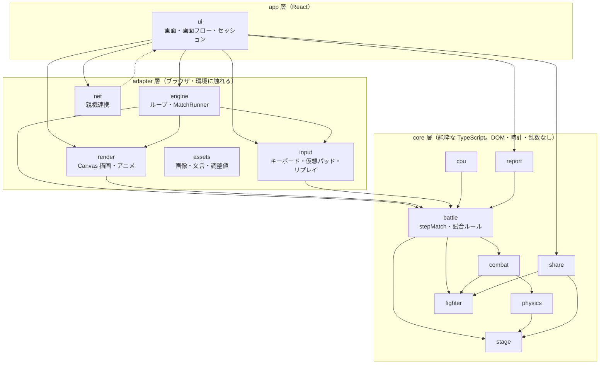

# フロントエンド構成設計（frontend.md）

- 文書ID: ARCH-FRONTEND
- バージョン: 0.1
- 状態: 草案
- 上位文書: [system-overview.md](../00-overview/system-overview.md)（§7、§9、NFR-03、NFR-06）
- 関連: [legacy-assessment.md](./legacy-assessment.md)、[event-connection.md](./event-connection.md)、[combat-system.md](../03-combat/combat-system.md)、[pc-ui.md](../06-ui/pc-ui.md)、[ui-design.md](../06-ui/ui-design.md)、[character-config.md](../02-fighter/character-config.md)、[stage-format.md](../04-stage/stage-format.md)、[event-control.md](../01-experience/event-control.md)
- 関連Issue: #17（本書）、#4、#20（エンジン）、#21（入力）、#22〜#24（物理・戦闘）、#72（簡易CPU）

## 1. 概要

TypeScript + React + Vite のフロントエンドを、次の2つの世界に分けて設計する。

| 世界 | 担当 | 性質 |
|---|---|---|
| **画面の世界**（React） | S01〜S12 の画面、フォーム、エディタ、Battle Report の表示 | イベント駆動。更新は必要なときだけ |
| **対戦の世界**（Canvas + ゲームループ） | 対戦・試し動かし（S05、S07、S10）の進行と描画 | 60 Hz の固定ステップ。React の再描画に依存しない |

両者の間に、**純粋な TypeScript で書いたゲームロジック（core）** を置く。core は DOM・React・Canvas・通信・時計を一切知らない。描画も入力も通信も、core の**外側のアダプタ**として差し替えられる。

## 2. 目的

- ゲームロジックを、ブラウザなし（Node 上の Vitest）で、決定的にテストできる。
- 入力（キーボード / 仮想パッド / 簡易CPU / リプレイ）を、対戦の側から見て同じ形にする。
- 親機との連携が失敗しても、対戦が止まらない構造にする（NFR-01）。
- 当日（親機のローカルサーバー配信）と持ち帰り後（GitHub Pages 配信）で、**同じビルド**が動く。

## 3. Requirements

| ID | 要求 | 本書での具体化 |
|---|---|---|
| NFR-03 | 対戦中60 FPS、操作遅延なし | §6（固定ステップのループ、React を毎フレーム使わない） |
| NFR-06 | 3Dを使わず Canvas 2D 中心 | §6.3（描画アダプタ） |
| §7 | ネットワーク対戦はローカル対戦と切り分けて開発できる | §8（対戦と通信の切り分け） |
| REQ-NET-01 / REQ-CPU-01 | スマホ単体、簡易CPU（目標） | §5（入力ソースの差し替え） |
| REQ-OPS-02 | 親機連携。通信できなくても体験が止まらない | §8.2（親機連携） |
| REQ-SHR-01 | 持ち帰り用QRから設定を復元 | §9（共有コーデック） |
| REQ-RPT-01 / 02 | Battle Report、各戦の設定保存 | §7.3（イベントからの集計） |
| NFR-08 | 外部資源に依存しない配信 | §10（配信上の制約） |

> **前提の更新:** system-overview.md §7 は「ネットワーク対戦」と書くが、REQ-NET-02（ブラウザ間のリアルタイム通信対戦）は 2026-10-04 に**取り下げ**られている（event-connection.md §2）。本書では、通信対戦を実装対象にせず、**将来つなげられる口（入力ソースの差し替え）を残す**ことで §7 の「切り分け」を満たす（§8.1）。

## 4. 論理モジュールと依存方向

### 4.1 モジュール一覧

既存の `src/` のディレクトリ（スキャフォールド済み）に、不足分を追加する。

| ディレクトリ | 層 | 責務 | 既存/新規 |
|---|---|---|---|
| `src/model/` | core | 共通の型と定数（`CharacterConfig`、`StageData`、`MatchResult`、`ProgressState`、`SessionSnapshot` など）。ロジックを持たない。他の core・adapter・app が import できる最下位の層（[data-model.md](./data-model.md)） | **新規** |
| `src/physics/` | core | 長方形（AABB）とタイルの衝突、重力、着地、場外判定。ステップ単位の純関数 | 既存 |
| `src/combat/` | core | 攻撃のフレーム、ヒット判定、ダメージ蓄積、吹き飛ばし、無敵・ヒットストップ | 既存 |
| `src/fighter/` | core | `CharacterConfig`、能力値の検証、能力値→物理パラメータの変換、ポイント制 | 既存 |
| `src/stage/` | core | `StageData`、検証、プリセット。エディタの操作ルール（配置・消去）の純粋な部分 | 既存 |
| `src/battle/` | core | 試合ルール（ストック、時間、リスポーン、勝敗）、**1ステップの更新 `stepMatch`**、先行入力 | 既存 |
| `src/report/` | core | 試合のイベント列から Battle Report と第1戦・再戦の比較を作る | 既存 |
| `src/cpu/` | core | 簡易CPUの意思決定。盤面を読み、入力を返す（#72） | **新規** |
| `src/share/` | core | 持ち帰りデータの符号化・復号（Base64URL、ビットづめ）、検証の呼び出し | **新規** |
| `src/progress/` | core | 親機の進行状態の管理（フェーズの遷移、一斉リセット、再戦の受付）と、進行状態の検証。親機サーバー（`server/`）と参加者PCの両方が使う（[event-control.md](../01-experience/event-control.md)） | **新規**（#67） |
| `src/input/` | adapter | `InputSource` の定義と実装（キーボード、仮想パッド、CPU、リプレイ） | 既存 |
| `src/render/` | adapter | Canvas 2D の描画（ステージ、パーツ合成のファイター、エフェクト）、アニメーション | **新規** |
| `src/engine/` | adapter | ゲームループ（固定ステップ + 上限付き積算）、`MatchRunner`、キャンバスのサイズ管理 | 既存 |
| `src/net/` | adapter | **親機連携のクライアント**（進行状態の取得、`sessionId` の監視）。通信対戦はしない（§8.2） | 既存 |
| `src/assets/` | adapter | 同梱の画像・パーツ・文言・調整値（`config`）。外部から読まない | 既存 |
| `src/ui/` | app | React。画面（S01〜S12）、共通コンポーネント、画面フロー、セッションの状態、HUD | 既存 |

「core」「adapter」「app」の3層に分ける。層の名前は、依存の向きを決めるために使う。

### 4.2 依存方向



（`net -.-> ui` は、`net` が `ui` を import せず、`ui` が渡すコールバックで通知する、という意味。§8.2）

### 4.3 依存の規則

| # | 規則 | 理由 |
|---|---|---|
| D1 | **core は adapter・app を import しない。** `react`、`document`、`window`、`performance.now`、`Math.random`、`fetch`、`localStorage` を使わない | ブラウザなしでテストでき、決定的になる（§11） |
| D2 | core 内の依存は、`battle → combat → physics` の一方向。`fighter`・`stage` はデータと検証だけで、他の core を import しない（型の共有を除く） | 循環を防ぐ |
| D3 | adapter どうしは、原則として互いに import しない。つなぐのは `engine`（と `ui`）だけ | 差し替えの単位を小さくする |
| D4 | `ui` は、ゲームの内部状態（`MatchState`）を React の state に**入れない**。HUD 用の小さな読み取り専用スナップショットだけを受け取る（§6.4） | 60 FPS を React の再描画が妨げない（NFR-03） |
| D5 | 外部から入るデータ（QR、保存データ、親機の応答）は、境界で**検証してから** core に渡す。検証は core（`fighter`・`stage`）の関数を使う | 不正値で対戦が壊れない |
| D6 | 時刻と乱数は、**引数で注入する**。core は `step` の番号だけを時間として扱う | 決定性（combat-system.md §4 の「乱数を使わない」） |

D1〜D3 は、ESLint の `no-restricted-imports`（ディレクトリごとの禁止リスト）と、core ディレクトリに限った `no-restricted-globals` で**機械的に検査する**。CI の lint で違反が落ちる（導入は #20 のスキャフォールドに含める）。

## 5. 入力の抽象化

### 5.1 目的

キーボード、仮想パッド、簡易CPU、リプレイ（テスト用）、将来のネットワーク入力を、**対戦の側から見て同じもの**にする（pc-ui.md §5）。

### 5.2 インターフェース

**この型は `battle/`（core）に置く。** `input/`（adapter）が実装し、`cpu/`（core）も同じ型を実装する。core が adapter を import しないため（D1）。

```ts
/** 1ステップ分の、1人の入力。core が受け取る唯一の入力の形 */
type PlayerInput = {
  left: boolean // そのステップで押している（短い入力は、ラッチで1ステップ分に含める）
  right: boolean
  jumpPressed: boolean // そのステップで「押した瞬間」があった（エッジ。ラッチ済み）
  attackPressed: boolean
}

/** 入力ソース。対戦の側は、これだけを知っている */
interface InputSource {
  /** 次のステップの入力を取り出す。ラッチしたエッジはここで消費する */
  sample(ctx: SampleContext): PlayerInput
  dispose(): void
}

type SampleContext = {
  step: number // 試合内のステップ番号
  observation: Observation // 盤面の読み取り専用ビュー（CPU だけが使う。他は無視）
}
```

- `sample` は、**ステップごとに1回だけ**呼ばれる（`MatchRunner` が、固定ステップの中で呼ぶ。§6.2）。画面の更新やイベントの順序に依存しない（pc-ui.md §5.5）。
- `PlayerInput` に入るのは**生の操作**だけ。先行入力（4ステップ）、やられ中の入力の破棄、向きの決定、左右同時押しの打ち消しは、**core（`battle`）が行う**（pc-ui.md §5.1〜§5.4）。どの入力ソースでも同じ規則が働き、キーボードだけ挙動が違う、ということが起きない。
- 左右同時押しの打ち消しなどを core で行うことで、リプレイ・CPU・仮想パッドが、同じテストで検証できる。

### 5.3 実装

| ソース | 配置 | 内容 | マイルストーン |
|---|---|---|---|
| `KeyboardSource` | `input/` | `KeyboardEvent.code` で判定（1P: A D W スペース（補助の F）、2P: テンキー 4 6 8 0（補助の 5）と ← → ↑ /。pc-ui.md §4）。`keydown` を次のステップまでラッチ。`event.repeat` は無視。対戦に使うキーは `preventDefault`。1つのインスタンスが1Pと2Pの2つの `InputSource` を提供する（同じキーボードイベントを1か所で受けるため） | M2（MVP） |
| `VirtualPadInput` | `input/` | タッチ（Pointer Events）の仮想コントローラー。指（`pointerId`）ごとに押しているボタンを持ち、マルチタッチで移動と攻撃を同時に受ける。押した瞬間はキーボードと同じくラッチする。ダブルタップズームとスクロールの抑止は、`ui/` の画面側（mobile-ui.md §6、§7） | M3 |
| `CpuSource` | `cpu/`（`InputSource` を実装） | `observation` を読み、`PlayerInput` を返す。プレイヤーと**同じ入力の形・同じ物理・同じ能力値の規則**で動き、`MatchState` を書き換える手段を持たない（REQ-CPU-01） | M3 |
| `ReplaySource` | `input/` | 記録した `PlayerInput` の列を再生する。テストと、バグの再現に使う | M2（テスト用） |
| `RemoteSource`（予約） | — | 実装しない。§8.1 | — |

- `CpuSource` は `cpu/` に置くが、ブラウザに触れないので core 層に属する。`input/` が `cpu/` を import する必要はなく、`ui`（または `engine` の組み立て部分）が `InputSource` を作って `MatchRunner` に渡す。
- 仮想パッドは、`ui/` の React コンポーネント（`VirtualPad`。ボタンの描画と、指の下のボタンを決める処理）と、`input/` の `VirtualPadInput`（状態の保持）に分ける。コンポーネントは Pointer イベントを、指の下のボタンに直して `VirtualPadInput` に渡すだけ。

### 5.4 キー確認画面（S06）

S06 のキーの確認（押すと光る。pc-ui.md §7）は、`KeyboardSource` が持つ**押している状態の読み取り専用ビュー**を購読する。対戦用のラッチとは別の経路にする（確認画面が、対戦のエッジを消費してしまわないように）。

## 6. 対戦の世界（ゲームループと描画）

### 6.1 役割の分担

```mermaid
sequenceDiagram
  participant RAF as requestAnimationFrame
  participant Loop as engine: GameLoop
  participant Run as engine: MatchRunner
  participant In as InputSource ×2
  participant Core as core: stepMatch
  participant Rd as render: Renderer
  participant UI as ui: HUD / Report

  RAF->>Loop: frame(now)
  Loop->>Loop: 経過時間を積算（上限あり）
  loop 積算が 1/60 秒以上、かつ 5 ステップまで
    Loop->>Run: step()
    Run->>In: sample()（1P・2P）
    Run->>Core: stepMatch(state, inputs) → (state', events)
    Run->>UI: events を report に渡す／HUD 用の値が変わったときだけ通知
    Run->>Rd: pushEvents(events)（キューにためる）
  end
  Loop->>Rd: draw(prev, curr, 補間 alpha)（キューのイベントを消費して演出）
```

### 6.2 ゲームループ（`engine/`）

- **固定ステップ 60 Hz** で `stepMatch` を呼ぶ。描画は `requestAnimationFrame` に合わせる。高リフレッシュレートの画面でも物理の速さが変わらない（combat-system.md §4）。
- 1フレームあたりの**最大ステップ数は 5**（legacy-assessment.md §3.4 の `maxStepsPerFrame` を踏襲）。超えた分の物理の進行は**捨てる**（追いつこうとして暴走しない。低性能端末を考慮）。
- 捨てた分で**試合の制限時間だけが遅れない**ようにする（90秒の試合が、低性能端末で実時間の数分に延びるのを防ぐ。battle-rules.md §4）。`MatchRunner` が、捨てたステップ数を `clockSkip`（そのステップで、制限時間から**追加で引く**ステップ数。物理・戦闘には影響しない）として `stepMatch` の入力に渡す。`clockSkip` は入力の一部としてリプレイに記録するため、決定性は保たれる。
- タブが非表示になった／復帰したときは、経過時間を上限で丸める（長い停止のあとに、まとめて進まない）。
- 描画には、直近の2ステップの状態と、その間の補間率 `alpha`（0〜1）を渡す。補間は**描画だけ**に使い、core の状態には影響させない。
- ループは、`start()` / `stop()` を持つ小さなクラスで、**時刻の取得と `requestAnimationFrame` を差し替えられる**（テストでは手動で時間を進める）。コンポーネントの unmount で、必ず `stop()` と `InputSource.dispose()` を呼ぶ。
- ループの中の例外は、捕まえて**ループを止め、安全な画面（S06 へ戻る案内）へ遷移する**。スタックトレースは参加者に見せない（ui-design.md §10 の安定運用）。

### 6.3 描画（`render/`）

- `Renderer` は、`pushEvents(events: MatchEvent[]): void` と `draw(prev: MatchSnapshot, curr: MatchSnapshot, alpha: number): void` を持つ。`prev` と `curr` は、**隣り合う2つのステップ**の状態で、`MatchRunner` が毎ステップ保持して渡す（1フレームに複数ステップ進んでも、補間は最後の1ステップの区間で行う）。`MatchRunner` が**ステップごとに** `pushEvents` でイベントをキューにため、`draw` がまとめて消費して演出（ヒットの効果、揺れ）を起こす。1フレームに複数ステップが進んでも、イベントを取りこぼさない（最終のスナップショットからは復元できないため）。キューは演出が終われば捨てる（上限つき）。`MatchSnapshot` は core の `MatchState` の読み取り専用ビュー。**描画は状態を書き換えない**。
- Canvas 2D だけを使う（NFR-06）。内部の座標系は、ステージの**セル単位**（stage-format.md §4）。画面への変換は、`Renderer` の中だけで行う。
- 基準の大きさは 1280 × 720。実際の画面サイズに合わせて CSS で拡大し、`devicePixelRatio` に合わせて内部解像度を設定する（ui-design.md §9）。
- ファイターは、少数のパーツを合成して描き、アニメーション（Idle、Run、Jump、Fall、Attack、Hit、KO）を**パーツの移動・回転・拡大縮小**で表す（animation.md）。使うポーズの選択は、`MatchState` のファイターの状態（`fighter.state`）から決める。見た目は**当たり判定に影響しない**（REQ-FTR-05）。判定は常に core の長方形。
- 画像・パーツ・文言は `assets/` から読み、**外部から読み込まない**（§10）。
- legacy-assessment.md の判定に従い、ステージのセル描画とクリック座標→セルの変換は `oc26-stage` の `renderer.js` を Refactor して使う。キャラクターの描画は新規に作る（Replace）。

### 6.4 React との境界

| 流れ | 方法 | 頻度 |
|---|---|---|
| ui → 対戦（開始・終了） | `MatchRunner` を生成して `start()`。canvas 要素の参照は、`useEffect` で渡す | 対戦ごとに1回 |
| 対戦 → ui（HUD） | `MatchRunner` が、**HUD の値が変わったときだけ**通知する小さなストア（`useSyncExternalStore` で購読）。値は、蓄積ダメージ（整数）、ストック、残り時間（秒）、READY・FIGHT・END の段階 | 値が変わったときだけ |
| 対戦 → ui（結果） | 対戦の終了時に、`MatchResult`（§7.3。battle-report.md §6 で定義済みの型。comparison.md §3.1 の入力と同じ）を1回渡す | 対戦ごとに1回 |

- 毎ステップ・毎フレームの状態を、React の state に入れない（D4）。HUD は、React が描く DOM の重ね表示（Canvas の上）とする。文字は読みやすく、`ui-design.md` の部品と同じものを使える。
- 試し動かし（S05）と対戦（S07、S10）は、**同じ `MatchRunner`** を、ルール設定（試し動かしは、ストック無制限・時間無制限など）だけ変えて使う。

## 7. ゲームロジック（core）

### 7.1 状態更新の形

```ts
type MatchState = {
  step: number
  fighters: [FighterState, FighterState]
  rules: MatchRules // ストック、時間、リスポーン位置（battle-rules.md）
  // …
}

/** 1ステップ進める。副作用なし・乱数なし・時計なし */
function stepMatch(
  state: MatchState,
  inputs: [PlayerInput, PlayerInput],
  clockSkip: number, // 捨てたステップ数。制限時間からだけ引く（§6.2）。通常は 0
  ctx: MatchContext, // 変わらない文脈。ステージ、2人の能力値から導いた物理パラメータ
): { state: MatchState; events: MatchEvent[] }
```

- `stepMatch` は**純関数**で、入力が同じなら結果が同じ（combat-system.md §10）。状態は不変データとして扱い、更新では新しい値を返す（スナップショットの共有・テストの比較が安全。2人分で計算量は小さく、60 FPS に影響しない）。
- 内部の順序は、`battle` が、先行入力の処理 → 向きと移動 → `physics` の移動と衝突 → `combat` のヒット判定とダメージ → 場外・撃墜・リスポーン → 勝敗、の順で `physics` と `combat` を呼ぶ。順序は combat-system.md §7 に従う。
- 能力値から物理パラメータへの変換は、**対戦の開始時に1回**、`fighter` が行い、`MatchContext` に入れる（legacy-assessment.md §3.5 の指摘: パラメータはグローバルではなく、物体ごとに引数で渡す）。

### 7.2 イベント

`stepMatch` は、状態とともに**イベント**（`hit`、`ko`、`respawn`、`jump`、`move` など）を返す。イベントは、次の3か所で使う。いずれも、core の状態を読むのではなく、**イベントの列だけを見る**。

| 使う側 | 用途 |
|---|---|
| `report` | 与ダメージ、撃墜数、動いた距離などの集計（battle-report.md §5） |
| `render` | ヒットの演出、揺れ（見た目だけ。状態に戻さない） |
| テスト | 期待するイベントの列を検証する |

### 7.3 Battle Report

- `report` は、`MatchEvent[]` と、対戦開始時の `CharacterConfig` ×2・`StageData` から `MatchResult` を作る**純関数**を持つ（REQ-RPT-02: 各戦の設定を保存して比較に使う）。
- `MatchResult` は JSON にできる値だけで構成する。保存方式（メモリ、sessionStorage、localStorage）は、`ui` の**セッション保存の口**（§9.2）の後ろに隠し、`report` は知らない。

### 7.4 簡易CPU（目標機能）

- `cpu/` は `decide(observation, ...) → PlayerInput` を実装し、`CpuSource` から呼ぶ。`Observation` は、`MatchState` から作る**読み取り専用のビュー**で、プレイヤーが画面から知り得る情報（位置、速度、蓄積ダメージ、攻撃の状態）だけを含む。内部の判定値や、相手の次の入力は含めない（特別な能力を持たせない）。
- CPU は乱数を使う場合も、**シードを引数に取る**（D6）。リプレイで再現できる。

## 8. 対戦と通信の切り分け

### 8.1 通信対戦（取り下げ）と、残す口

REQ-NET-02 は取り下げられた。本書は、通信対戦のコードを作らない。ただし、`MatchRunner` が `InputSource` だけを入力として受け取り、`stepMatch` が決定的であるため、将来、次の形で通信対戦をつなげられる。**つなげるための追加作業は、`net/` と `RemoteSource` の実装だけで、core の変更は要らない**。

```text
ローカル対戦:   KeyboardSource(1P) ┐
                KeyboardSource(2P) ┴→ MatchRunner → stepMatch
持ち帰り後:     VirtualPadSource   ┐
                CpuSource          ┴→ MatchRunner → stepMatch
（予約）通信:   KeyboardSource(自分) ┐
                RemoteSource(相手)   ┴→ MatchRunner（入力の遅延を待つ版）→ stepMatch
```

通信対戦を作る場合に必要になる検討（本書では行わない）: 入力の遅延と先行入力の関係、ステップの同期（ロックステップかロールバックか）、切断時の扱い。これらは、再び要求に戻ったときに、`05-multiplayer` に仕様を起こしてから決める。

### 8.2 親機連携（`net/`）

`net/` は、**親機との通信だけ**を担当する（event-control.md §8）。対戦とは独立して動く。

```ts
interface HostLink {
  /** 進行状態を定期的に取得する。失敗しても例外を投げない。
   *  通信できない状態が failOpenAfterMs（既定 10 秒。event-control.md §10）続いたら `null` を通知する */
  subscribe(listener: (p: ProgressState | null) => void): Unsubscribe
  dispose(): void
}
type ProgressState = { phase: Phase; sessionId: string; revision: number /* … */ }
```

| 規則 | 内容 |
|---|---|
| H1 | **対戦の進行（`MatchRunner`、core）は `HostLink` を一切参照しない。** 親機が止まっても、対戦は止まらない |
| H2 | `ui` が `ProgressState` を購読し、**新しく始める操作**（新しい対戦、設定の変更など）の可否だけを切り替える。すでに始まった対戦（READY、FIGHT、END）は、フェーズが変わっても終わるまで続ける（event-control.md §5.3、pc-ui.md §5.4） |
| H3 | `sessionId` が変わったら、`ui` がセッションの全データを破棄して S01 に戻す（event-control.md §9.1）。破棄は、`ui` のセッションの口（§9.2）が担当する |
| H4 | 親機と通信できなくなっても、まず直前の状態で体験を続ける。取得は黙って再試行し、参加者にエラーを見せない。**通信できない状態が10秒（既定。event-control.md §10）続いたら、`HostLink` が `null` を通知し、`ui` は操作の可否を『すべて許可』にする（フェイルオープン）。** フェーズの制限が掛かったまま止まらないようにするため。通信が回復したら、最新の進行状態に追従する（`sessionId` が変わっていれば H3 で初期化）。ブラウザは更新しない（縮退動作。event-connection.md §7） |
| H5 | 参加者のデータ（設定、ステージ、結果）は、親機へ送らない（event-control.md §8.2） |
| H6 | 持ち帰り後（GitHub Pages）は、親機がない。`HostLink` は、接続先がない構成では**何もしない実装**（`NullHostLink`）に差し替える。画面の分岐は、`HostLink` の実装の差し替えだけで済む |

実装（#68）: `src/net/hostLink.ts`（`createHostLink`、`nullHostLink`）、`src/ui/hostProgress.ts`（購読。GitHub Pages 用のビルドは `VITE_HOST_LINK=off` で `nullHostLink`）、`src/session/gate.ts`（H2: 画面・操作ごとの可否と理由）、`src/session/sync.ts`（H3）。画面の中の操作が止まっているときは、画面を `inert` にして（表示のみ）、理由を出す。「はじめる」「さいせん」「おわる」は、ボタンごとに押せなくして、理由をボタンの近くに出す。

この境界により、「通信がなくても動く」ことが型のレベルで保証される（`HostLink` を使わない `ui` の部分がある、`MatchRunner` は `HostLink` を知らない）。

## 9. 画面の世界（`ui/`）

### 9.1 画面フロー

- 画面 S01〜S12（user-flow.md）の遷移は、**ルーターのライブラリを使わず**、純粋な reducer（状態機械）で表す。`(flow, action) → flow`。遷移の可否（戻れる画面、戻れない画面、S09 の完了条件）は、この reducer が持ち、React に依存しないため、単体でテストできる。
- URL は、持ち帰りデータを運ぶためだけに使う（フラグメント `#…`）。**例外として、起動時に `?reset` を判定する**（event-control.md §9.1.1 の個別リセット用ブックマーク）。`?reset` があれば、**セッションの復元より前に** `SessionRepository.clear()` を呼び、S01 から始める（前の参加者のデータを次の参加者に見せない）。画面の遷移で URL を変えない（静的配信で、親機・GitHub Pages のどちらでも、パスの設定なしで動く）。

### 9.2 セッションの状態

- 参加者のデータ（`CharacterConfig` ×2、`StageData`、`MatchResult[]`、フロー）は、**1つのセッションストア**（React の `useReducer` + Context、または `useSyncExternalStore` 用の小さなストア。追加の状態管理ライブラリは入れない）が持つ。
- 永続化は、`SessionRepository`（`load()` / `save(snapshot)` / `clear()`）の後ろに隠す。**保存方式は [data-model.md](./data-model.md) §6 で決定済み**（`localStorage` の1キー `ocbs.session`。`sessionId` を体験のデータと一緒に保存）。`ui` は、次の制約を守って `SessionRepository` を使う。
  - `load` / `save` は、利用できない環境（無効化、容量超過）でも**例外を投げず**、体験を止めない（try/catch。legacy-assessment.md §3.12 の作法）。
  - 保存するのは、設定・ステージ・戦の記録・フロー。対戦中の途中状態（`MatchState`）は保存せず、更新（再開）では S06 から再開する（user-flow.md §6.1.1）。
  - 読み込んだ値は、境界で**検証してから**使う（D5）。

### 9.3 エディタ

- ステージエディタ（S04）の操作ルール（「押した先が選択中の種別と同じなら、そのドラッグ全体を消去にする」「1ストロークで同じセルは1回だけ」。legacy-assessment.md §3.7）は、`stage/` の**純粋な関数**として持つ。`ui` の Canvas・Pointer イベントは、座標をセルに変換して、この関数を呼ぶだけ。
- ファイター作成（S02、S03）の検証（ポイント制、許可ID）も `fighter/` の関数を使う。画面は、検証結果を表示するだけ。

### 9.4 共有コーデック（`share/`）

- 持ち帰り用QR・URLの符号化・復号（Base64URL、ビットづめ。stage-format.md §9）は、`share/` の純関数にする。DOM・`location` を参照しない（公開URLは、設定値として引数で受ける。legacy-assessment.md §3.8）。
- `decode` は、**例外を投げず**、失敗時に、理由つきの結果を返す（`{ ok: false, error }`）。復元後の値は `fighter` / `stage` の検証を通す（D5）。呼び出し側（`ui`）が、失敗時の画面を決める。
- QRコードの図形の生成（`qrcodegen`）は、`share/` の外（`ui/` 側のアダプタ）に置く。符号化の関数を、図形生成から独立させる。

## 10. 配信と実行環境の制約

| 項目 | 方針 | 根拠 |
|---|---|---|
| ビルドの成果物 | **1つのビルド**を、親機のローカルサーバー（当日）と GitHub Pages（持ち帰り後）の両方で使う。Vite の `base` は相対（`./`）にし、サーバーのパスに依存しない | NFR-08、event-connection.md |
| 外部資源 | フォント・画像・スクリプトを**外部から読まない**。すべて同梱する（会場の有線LANはインターネットに出られない） | ui-design.md §10 |
| 非セキュアな接続 | 当日は HTTP で配信される。Service Worker、Clipboard API など、セキュアなコンテキストを要求するブラウザ機能に**依存しない**（使う場合は、使えないときの代替を用意する） | event-connection.md §6 |
| 対象ブラウザ | PC は、デスクトップブラウザ。スマホは iOS Safari、Android Chrome（持ち帰り後） | NFR-04 |
| 画面の大きさ | 基準 1280 × 720 の16:9、スクロールなし | ui-design.md §9 |
| 文言・調整値 | `assets/` の設定ファイルに集約し、コード修正なしで直せる | ui-design.md §10、legacy-assessment.md §3.11 |
| スマホ | スマホで開くと、復元した設定を表示し、「スマホで あそぶ」から、横持ちの仮想コントローラーで遊べる。`ui` と core は PC と同じものを使い、入力ソースだけを差し替える | event-connection.md §5.4、mobile-ui.md |

## 11. テスト容易性

| 対象 | 方法 | 環境 |
|---|---|---|
| `physics`、`combat`、`fighter`、`stage`、`battle`、`report`、`share`、`cpu` | Vitest の単体テスト。DOM を使わない（`environment: node`） | Node |
| 試合全体 | **リプレイテスト**: `ReplaySource` に入力の列を与え、`stepMatch` を N ステップ回し、最終状態とイベント列を、期待値（スナップショット）と比べる。同じ入力から同じ結果になること（決定性）を検証 | Node |
| 入力ソース | `KeyboardSource` に合成した `KeyboardEvent` を渡し、ラッチ、リピート無視、同時押しを検証 | jsdom 相当 |
| ゲームループ | 時刻と `requestAnimationFrame` を差し替え、積算・5ステップの上限・非表示からの復帰を検証 | jsdom 相当 |
| 画面フロー reducer | 遷移表のテスト（戻れない画面、S09 の完了条件） | Node |
| `ui` のコンポーネント | Testing Library で、主要画面の操作（選択、ポイント配分、遷移）を検証 | jsdom 相当 |
| 親機連携 | `HostLink` に偽の実装を差して、接続失敗・`sessionId` の変化・フェーズ変更に対する画面の反応を検証 | jsdom 相当 |

- 既存のスキャフォールド（Vitest、`src/App.test.tsx`）を使う。core のテストは、ソースと同じディレクトリに `*.test.ts` で置く。
- `oc26-stage` のテスト（`physics.test.js`、`stage.test.js`、`codec` のテスト）は、Refactor した資産の移植時に、TypeScript へ移す（legacy-assessment.md §3.16）。

## 12. 例外・制約

- **core にブラウザの API を入れない**（D1）。入れたくなったら、アダプタの側へ移すか、引数で注入する。
- **スキャフォールドのディレクトリ名は変えない。** `render/`、`cpu/`、`share/`、`model/` の4つを追加する。`net/` は、通信対戦ではなく親機連携のために使う。名前と中身の対応は、この文書（§4.1）が基準。
- 状態管理、ルーティング、ゲームエンジン（Phaser など）、物理エンジンのライブラリは**導入しない**。理由は、規模が小さく、決定性とテスト容易性を自前の純関数で確保できるため（system-overview.md §7.1「高度な物理エンジンは MVP に含めない」）。追加のライブラリが必要になったときは、この文書に理由を記録する。
- ループの1ステップあたりの処理は、2人分の長方形判定と数式のみ。性能の目標は NFR-03（60 FPS）。実機での確認は、会場と同じ種類のPC・低性能スマホで行う（#51）。
- 本書は構成を定める。`MatchState` の全フィールド、イベントの種類、`HUD` の値の詳細は、実装時（#20、#22〜#24）に決め、必要なら本書を更新する。

## 13. Acceptance Criteria

- [ ] 論理モジュールの責務と依存方向が図示されている（§4.1、§4.2）
- [ ] ゲームロジックが描画・通信から独立しテスト可能な構成である（§4.3 D1〜D6、§7、§11）
- [ ] 入力ソース（キーボード/仮想パッド/ネットワーク）を差し替え可能な設計である（§5。ネットワークは予約。§8.1）
- [ ] ゲームループと描画、React の役割分担が示されている（§6）
- [ ] 通信（親機連携）が失敗しても対戦が止まらない構造である（§8.2）
- [ ] 依存規則を機械的に検査する方法が決まっている（§4.3）

## 14. 変更履歴

| 日付 | 変更内容 | 理由 | 影響範囲 |
|---|---|---|---|
| 2026-10-04 | 初版 | #17 の対応。通信対戦（REQ-NET-02）の取り下げを踏まえ、「ネットワーク対戦との切り分け」を、入力ソースの差し替え口として残す形にした | #20、#21、#22〜#24、#72、#18（保存方式）。src/ に `render/`、`cpu/`、`share/` を追加する |
| 2026-10-05 | `model/` を追加（共通の型）。保存方式を data-model.md で確定 | #18 の対応 | data-model.md、src/model/ |
| 2026-10-09 | §4.1 に `src/progress/`（core）を追加 | #67 の実装。親機サーバーと参加者PCで、進行状態の検証を共有するため | event-control.md、event-host.md |
| 2026-10-09 | §8.2 に、親機連携の実装（#68）の場所を追記 | #68 の実装 | event-control.md、data-model.md |
| 2026-10-10 | §5.3 の仮想パッドを `VirtualPadInput` として実装。§10 のスマホの扱いを更新 | #49 の実装 | mobile-ui.md、src/input/virtualPad.ts |
